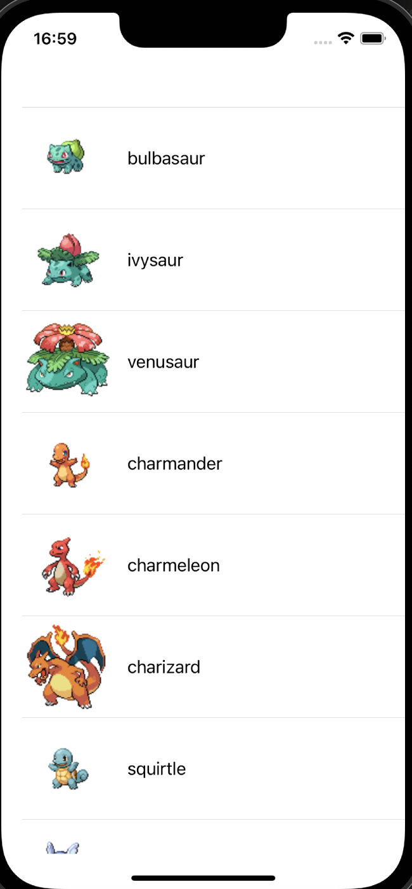
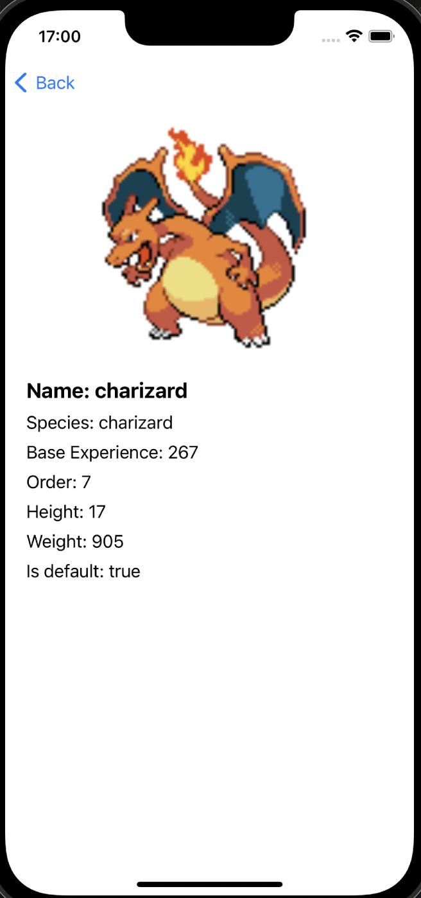

# PokeApp

Pokemon app for listing pokémons. The app shows two screens, a list screen with a list of pokémons by order (first generation, then second, etc) and a detail screen with some of the chosen Pokémon's characteristics.

### App Screens

{: width="50%"}
{: width="50%"}

### Architecture

The architecture for this app is a MVVM-C (Model-View-ViewModel-Coordinator) architecture.

### Future improvements

- Mark pokémons as favourites (saving to CoreData or other persistence library)
- Search pokémons functionality in the list screen (or add new screen with search filters)
- Show evolution lines and other details in the details screen
- Add a dependency injection solution

